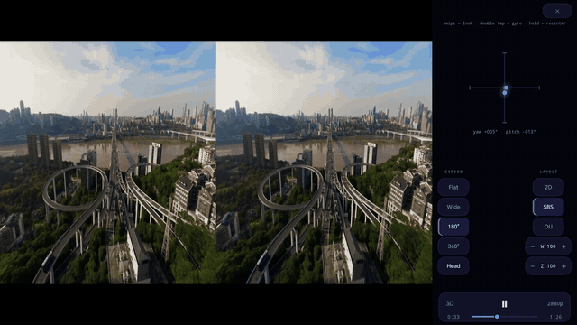
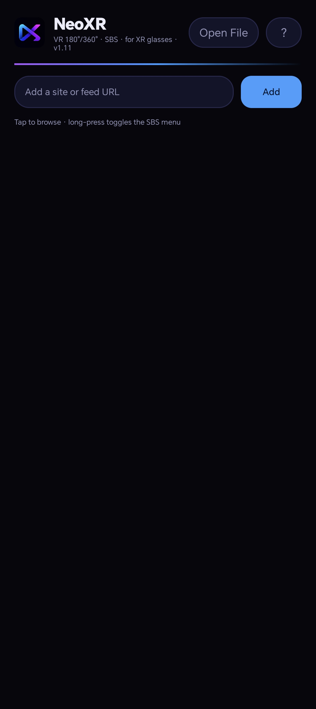
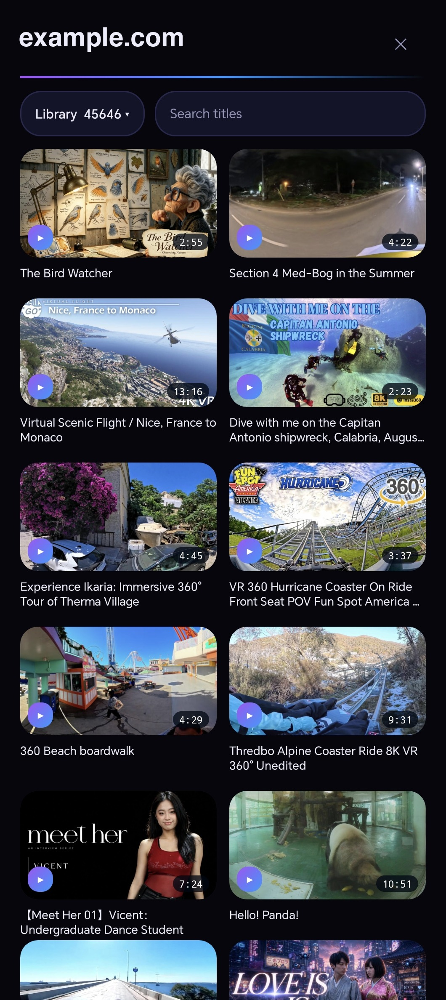
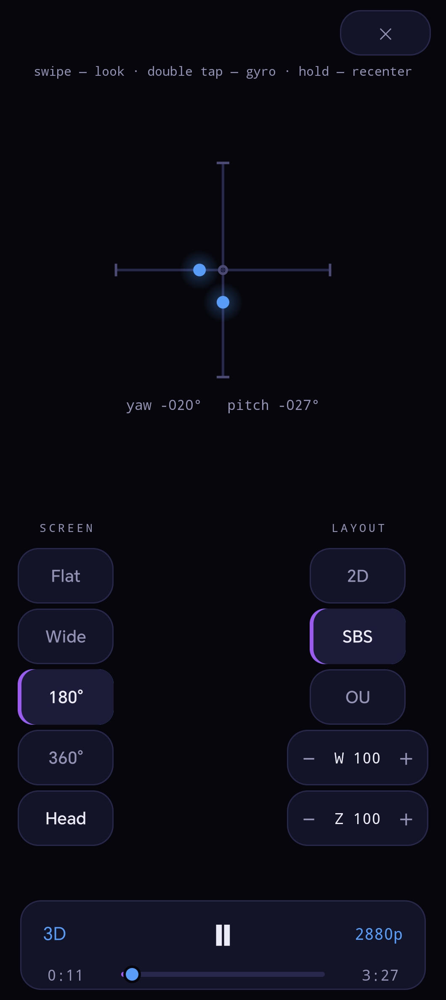
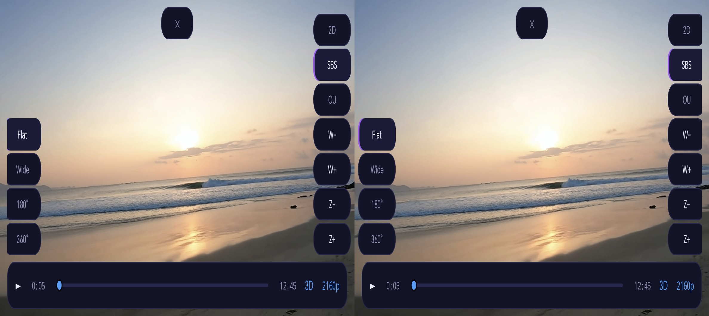

# NeoXR

A small VR video player for XREAL One and One Pro glasses.

Plug the glasses into your phone. The video plays **on the glasses** at their native
resolution, and the phone becomes a remote control with a touchpad. NeoXR plays
180° and 360° video, side-by-side and over-under 3D, local files, and video from
sites that serve a [DeoVR JSON API](https://deovr.com/app/doc) feed.

## Demo

Left: what you see in the glasses. Right: the phone acting as the remote.

<p align="center">
  <a href="docs/video/demo.mp4">
    
  </a>
  <br>
  <a href="docs/video/demo.mp4"><b>▶ Watch the full demo (1:44)</b></a>
</p>

| Main menu | Video list | Player remote |
|---|---|---|
|  |  |  |

Without glasses the video stays on the phone as a split SBS pair, for the glasses'
mirroring mode:

<p align="center">
  
</p>

## What it does

- **Plays on the glasses, not on the phone.** The glasses are a real external
  display over USB-C, so NeoXR renders straight to them. Nothing is mirrored and
  nothing is rescaled.
- **The phone is the remote.** A large touchpad moves a pointer on the glasses:
  tap to click, two fingers to scroll. The screens you need are in the glasses, the
  buttons are under your thumb.
- **Head tracking.** The view can follow your head, using the motion sensor inside
  the glasses (see [Head tracking](#head-tracking) below).
- **Any format, detected automatically.** Screen shape (flat, wide, 180°, 360°) and
  3D layout (2D, side-by-side, over-under) come from the video metadata, the file
  name, or the frame shape — and you can always set them by hand.
- **Three ways to get video:** a site feed, the built-in browser, or a local file
  (local videos are grouped by folder).
- **Picture controls:** zoom, width, height, stereo depth and eye swap, per video.
- **Audio tracks and subtitles** for files that carry more than one.
- **No account, no ads, no tracking.** The app has no analytics and makes no network
  requests beyond the sites you open yourself.

## Requirements

- XREAL One or One Pro glasses. Other glasses that work as a USB-C display may work
  too — [tell us](../../issues/new?template=device_report.md) if you try.
- An Android phone with USB-C DisplayPort output, Android 8.0 or newer.
- For stereo video: **3D / SBS mode enabled** in the glasses menu.

> **Tip:** you switch SBS on and off often — once for 3D video, once back for sharp
> 2D browsing. Assign **3D / SBS** to the glasses' Quick Button (for example to a
> long press) and it becomes a one-touch change instead of a walk through the menu.

## Install

1. Download the latest `NeoXR.apk` from [Releases](../../releases/latest).
2. Open the file on your phone and allow the install.
3. Android warns you about installing from an unknown source. That is normal for
   apps distributed outside Google Play.

To get updates automatically, use [Obtainium](https://github.com/ImranR98/Obtainium):
add this repository URL and it will follow new releases.

## Getting started

1. Connect the glasses to your phone with a USB-C cable.
2. Open NeoXR. The menu appears in the glasses; the phone shows the touchpad.
3. Add a video source:
   - **A site feed** — type a site address in the input field and press Add (or Done
     on the keyboard). If the site serves a DeoVR JSON API feed, you get a video
     list with previews. If it does not, the site opens in the built-in browser.
   - **A local file** — press *Open File* and pick a video from your phone. NeoXR
     also appears in the system *Open with* and *Share* menus.
   - **From the browser** — play a video on any site, then press **▶ Play VR** to
     open that stream in the VR player.

## Controls

In the menu, the video list and the browser:

| Action | Result |
|---|---|
| Drag on the touchpad | Move the pointer |
| Tap | Click |
| Two fingers | Scroll |
| Long press (without glasses) | Turn the split SBS view on or off |

In the player:

| Action | Result |
|---|---|
| Swipe | Look around |
| Long press | Center the view |
| Double tap | Phone gyroscope on or off |
| Tap (without glasses) | Show or hide the controls |

The player has two button columns. **Screen** sets the shape: Flat, Wide, 180°,
360°. **Layout** sets the 3D format: 2D, SBS (side-by-side), OU (over-under).
`Z` sets the zoom, `W` and `H` squeeze the picture horizontally and vertically —
useful when a video is encoded with the wrong scale. `◄◄` and `►►` skip 10 seconds
back and 15 forward; hold them for one minute back and five forward. The `3D` button
opens depth adjustment and an eye-swap switch (for sources with the halves
reversed), and in landscape it also holds `W` and `H`. `CC` appears when a video
carries several audio tracks or subtitles; unsupported tracks are marked, and a
track the device cannot decode no longer stops playback — the video keeps running
without sound.

On a device with more than one display — a foldable, or a dual-screen handheld — a
**Screen** button appears and moves the video to the next display, in case the app
guessed wrong about which one is the glasses.

## Head tracking

The XREAL One series exposes its motion sensor as a network service on the glasses
themselves. NeoXR reads that sensor and turns head movement into camera movement, so
the video stays in place while you look around.

To use it:

1. In the **glasses menu**, switch the display mode from **Anchor** to **Follow**,
   and turn **Stabilizer off**. In Anchor mode the glasses hold the image in space
   themselves, so their motion is added on top of the app's and the picture moves
   twice. Recent firmware is required.
2. Open a video and press **Head** in the left column. The button appears only when
   the glasses are connected.
3. Look straight ahead and long-press to center the view.

Press **Head** again to go back to the phone gyroscope.

**If a VPN runs on your phone**, it may capture the connection to the glasses and
head tracking will not start. Either turn the VPN off, or use a client that lets
apps bypass the tunnel (in OpenVPN for Android: *Allow apps to bypass VPN* in the
profile settings).

## Known limits

- **3D SBS halves the horizontal resolution.** In stereo mode the glasses split the
  frame in two, so each eye receives half the pixels. This is a limit of the display
  link, not of the app. For maximum sharpness, watch flat video in 2D.
- **The keyboard does not work on the glasses.** Text fields open an editor on the
  phone instead. This is an Android limitation for external displays.
- **WebXR does not work** in the built-in browser: Android's WebView has no WebXR
  support, so "Enter VR" buttons on websites do nothing. Use ▶ Play VR instead.
- **Fisheye video** (MKX200, RF52 and similar) is shown as a regular dome, so the
  edges are not perfectly correct.
- Sites that need a login may work in the built-in browser, but NeoXR has no account
  support of its own.

## Build from source

```bash
git clone https://github.com/NeoXR-app/NeoXR.git
cd NeoXR
./gradlew assembleDebug
# APK: app/build/outputs/apk/debug/NeoXR.apk
```

You need JDK 17 and the Android SDK (compileSdk 34). Release builds are signed with
the key described in `keystore.properties`; without that file a release build falls
back to the debug key, so a fresh clone still builds.

## Contributing

Device reports are the most useful contribution. NeoXR is developed on one pair of
glasses and one phone, so reports from other hardware are the only way to learn what
works. Please use the
[device report](../../issues/new?template=device_report.md) template.

## License

[GPL-3.0](LICENSE). This is free software: you may use, study, share and modify it,
and any distributed derivative must stay under the same license.
